# 0.1 概述

本文档假定同学们已经具备了基本的 SQL 知识（如，DML功能和基本写法），因此内容将重点放在数据库引擎开发上。我们的数据库系统架构如图所示：

整体数据库框架主要由以下几部分组成。

1. 命令解析器，输入用户提交的SQL命令，解析用户指令，调用系统管理模块和查询解析模块的方法执行指令。
2. 查询解析模块，实现基本的 DML (Data Manipulation Language, 数据操作语言)，对数据库里的数据进行增删改查等基本操作。
3. 记录管理模块，上层增删查改的目标即是一条条记录，这个模块将文件数据组织成记录供上层使用。
4. 索引模块，查询执行过程中能会调用，通过直接从索引文件中读取数据来加速查询执行。
5. 页式文件系统（及其缓冲区），数据库底层存储模块，支持高层模块以页为单位进行文件读写。
6. 系统管理模块，实现基本的 DDL (Data Definition Language, 数据定义语言)，对数据库和数据表的存储进行管理。

注意：

1. 还有涉及到交互问题以及 CI 输出标准的用户部分，这将在[《0.3 前端约定》](./0-3-frontend.md)一节中提到。
2. 命令解析器将随文档一并提供（文法见[附件](../files.md)），我们统一使用 ANTLR4 来作为解析工具，详见第五章相关内容。
3. 页式文件系统及其缓冲区有一份“祖传实现”（代码见[附件](../files.md)），同时我们也在第一章提供了编写指引，你可以选择使用已有实现或自行实现。
4. 记录管理模块、索引模块、查询解析模块、系统管理模块是实验的主要内容。
