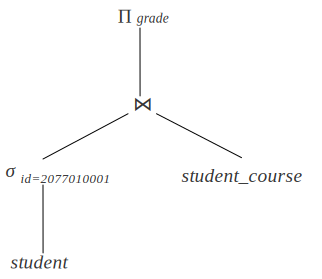

# 4.1 概述

查询处理指的是将查询语句转化为查询结果的过程，主要包含三个步骤：

1. 解析器对查询语句进行语法分析，转化为语法树。
2. 优化器首先将语法树转化为关系代数表达式树，我们将其称为逻辑查询计划树。进一步，根据数据的统计信息(如表的大小、是否有索引等)，为逻辑查询的每一步指定操作的顺序、使用的算法、访问数据的方式等，转化为物理查询计划树。
3. 执行器在数据库上执行查询计划，并返回查询结果。

下图展示了一条 SQL 语句和其对应的逻辑查询计划树，逻辑查询计划树每个节点表示一个关系代数运算。但是，每个关系代数运算存在不同的操作方式，如扫描表时是否使用索引，表的连接采用什么算法等。我们需要根据数据库的统计信息，如索引、记录数量等，为每个关系代数运算选择最优的算法。本章主要介绍扫描算法和连接算法。

 



