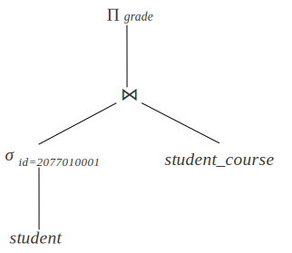

# 4.4 查询执行

截至目前，我们讨论的都是单个关系代数操作的执行算法。现在我们需要考虑，对于一个涉及多个算子的查询计划树，我们应该怎样去执行。一个最简单的策略是将所有查询算子按照一定的方法排序，每次执行一个算子，执行完后再执行下一个算子，称为**物化**策略。这种方法的缺点是需要将中间结果暂存，往往需要存到磁盘上，带来较大的开销。另一种策略是将多个算子同时执行，一个算子处理一条数据后，将数据传递给下一个算子，不需要存储中间结果，这种策略称为**流水线**策略。

我们考虑以下面这个关系代数表达式为例，描述物化策略和流水线策略的执行过程。

$$
\Pi_{grade}(\sigma_{id=2077010001}(student) \Join student\_course)
$$

- 物化（Materialization）

如果采用物化策略，我们将从最底层的扫描算子开始，首先对 student 表进行扫描，筛选出 id=2077010001 的记录，扫描完成后将筛选出的记录暂存。随后将暂存下来的记录和 student_course 表中的记录输入连接算子 $\Join$，执行连接操作。连接操作完成后，将连接的结果物化下来，最后交给查询计划树根节点的投影算子 $\Pi_{grade}$，投影算子输出查询的最终结果。

物化策略的查询开销不仅仅是所有查询算子开销之和，当中间结果较大、超出内存大小时，必须将其物化到磁盘上，这一过程也会产生不小的开销。

- 流水线（Pipelining）

物化策略的开销很大程度上来源于存储中间结果的过程，我们可以将关系代数树的多个算子组成一个流水线，每个算子的中间结果直接传递给流水线上的下一算子，从而避免存储中间结果的开销。

例如，$\Join$ 和 $\Pi_{grade}$ 算子可以组成流水线，每当连接算子产生一条结果时，马上就可以传给投影算子进行投影操作。通过结合连接和投影，避免中间结果的物化过程，直接产生最终结果。

流水线策略可以显著提高查询的执行效率，然而并不是所有算子都可以组成流水线。比如排序算子，在前一算子得到所有记录之前无法输出任何结果。

<!-- 目前仅讨论了单个关系运算如何执行，下面需要研究如何执行包含多个运算的查询计划树。

## 物化

最简单直观的想法是自底向上执行查询计划树，依次执行每个算子，每次执行的临时结果存储到内存或磁盘上，下一个算子在临时结果的基础上继续进行，这种执行策略称为**物化**。

物化方法的策略简单，但会产生大量的中间结果，占据磁盘和内存空间，且查询过程中需要多次访问磁盘，效率较低。

## 流水线

执行查询计划的另一种方法是同时进行多个运算，一个运算产生的结果直接传递给使用这个结果的下一个运算，不需要将中间结果存储到磁盘，这种方法称为**流水线**。

流水线中的每个操作可以由一个迭代算子来实现，每个迭代算子提供 Init 和 Next 接口。调用 Init 后，每次调用 next 返回该操作输出的下一条结果。同时迭代算子自身需要维护迭代状态，使得每次调用 next 返回正确的结果。 -->