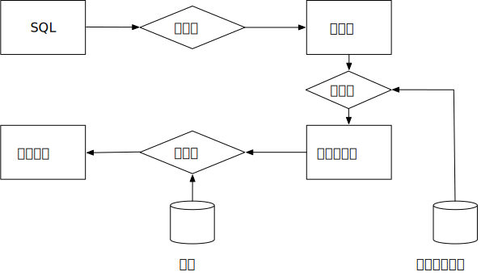

# 4.1 概述

查询处理指的是将数据从数据库中取出来的过程，包括查询解析、查询优化和查询执行三个步骤。



查询处理的第一步是查询解析，将上层的数据库查询语言转化为底层文件系统的操作。数据库的 SQL 语句对用户非常直观，但对系统内部实现并不友好，因此第一步需要将用户输入的 SQL 语句转化为一种中间表示，如关系代数。这一步骤类似于编译器语法解析的过程，查询解析器接受用户输入的 SQL，将其解析为关系代数表达式树。查询解析的详细介绍可参阅 5.1 和 5.2.

对于一条 SQL 查询，其对应的关系代数表达式往往有多种，如当我们想查询学号为2077010001同学的名字时，会写出下面这样的 SQL：

```SQL
SELECT name FROM student WHERE id = 2077010001;
```

这条 SQL 可以被解析为下面两种关系代数：

- $\sigma_{id=2077010001}(\Pi_{name}(student))$
- $\Pi_{name}(\sigma_{id=2077010001}(student))$

进一步，我们需要将关系代数的每一个操作转化为相应的查询算子，每一种查询算子对应于一种算法。一个关系代数操作对应的查询算法往往有多种，如选择操作可以通过全表扫描和索引扫描实现，表的连接操作可以通过嵌套循环连接、排序归并连接、哈希连接实现，我们将在 4.2 和 4.3 节介绍扫描算法和连接算法。一条 SQL 对应的多种关系代数该如何选择，以及如何选择关系代数对应的查询算子，是查询优化这一步骤需要考虑的事情，详细内容可参阅 5.3 和 5.4 节。

最后，在我们选择好关系代数每个操作对应的算法后，便得到了一个完整的查询执行计划，下一步需要考虑的是如何将该查询计划在底层的页式文件系统上执行，主要分为物化和流水线两种策略，详见 4.4 节。