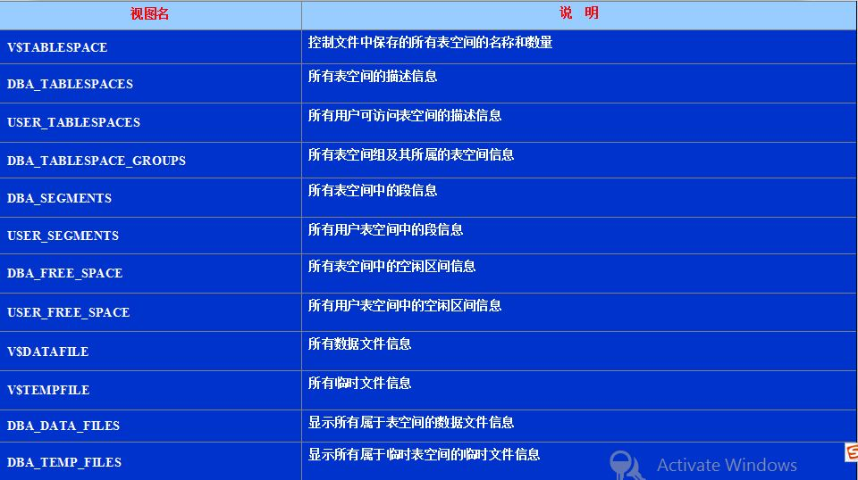

## 6.1 系统管理

在数据库系统中，系统管理模块用于数据库中的各类元信息管理，类比文件系统中对用户、文件（数据表）、文件夹（数据库实例）的管理。该模块主要提供两方面的功能，包括基本的数据定义语言和存储空间管理。

##### 1. 数据定义语言（Data Definition Language）

数据定义语言用于定义数据库中各类对象的（逻辑）数据结构，如关系表、索引、视图等。对于任意的数据结构，常见的数据定义语言主要包括创建（CREATE, ADD）、修改（MODIFY）、和删除（DROP）三类。比如，如果我们希望在学生选课信息表中添加"是否退课"属性，就可以利用如下的数据定义语言实现：

```SQL
ALTER TABLE student_course
ADD is_dropout char(1) NOT NULL;
```

##### 2. 数据库和数据表的存储管理 (阅读内容)

如前面第二章介绍，数据库的存储管理主要包括系统表空间管理和用户表空间管理两类，每类表空间又各自由一个或多个数据文件组成，如用户数据、临时数据、日志数据等等。因此，在做一个项目的时候，往往先创建一个数据库实例（CREATE DATABASE），然后创建表空间（CREATE TABLESPACE），再创建用户（CREATE USER），然后用户指定这个表空间。

首先，实际数据库中提供表空间的创建、修改、撤销、重命名等功能。例如学校管理员Stephen新建了一个教务数据库Lesson，然后需要创建一个表空间并分配给自己管理，则SQL语句如下：


```SQL
CREATE TABLESPACE lesson_space DATAFILE './lesson_space.dbf' SIZE 2000M;
```

```SQL
GRANT lesson_space to Stephen;
```


其次，为了方便对数据库中不同的表空间进行管理，实际数据库中经常维护大量的系统视图，提供不同表空间在不同方面的统计信息，例如：

