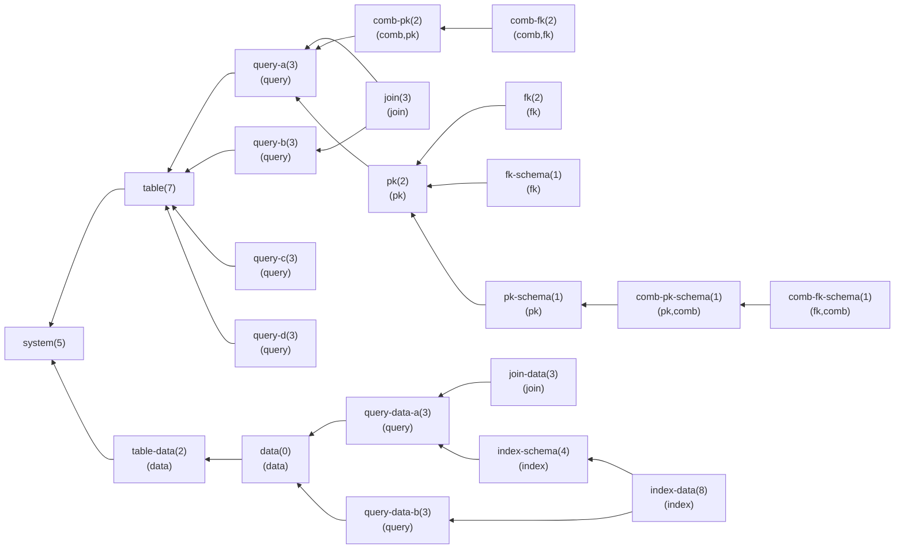
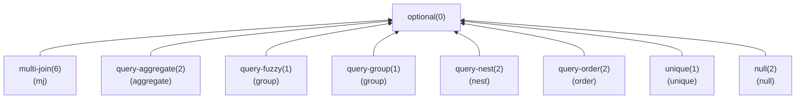

# CI 说明

CI（Continuous Integration，持续集成）是指软件发布流程的构建和单元测试阶段，GitLab、GitHub 等常见的基于 Git 的集成软件开发平台都带有类似的功能，我们将基于清华大学部署的 GitLab 的 CI 完成实验的自动化测试。

截止2023年秋我们实际上使用的是集成测试而非单元测试，它并不能让你的实验每完成一部分后便进行测试，它只能在你将整个实验几大模块都完成后基于SQL的执行情况进行功能性测试。

由于不同语言的程序需要不同的 CI 运行环境、依赖库等，我们只能适配有限的环境，截止2023年秋季助教预设的环境有 C++ 与 Python，因此如果你想选择其他语言，你可能需要自行编写对应的 Docker 镜像并联系助教，或者你也可以等到有人完成适配后再选择该语言。


!!! abstract "激励机制"

    如果你反馈了 CI 漏洞、测例错误、评测器逻辑错误等，甚至提了 PR，助教将根据贡献程度给同一问题的第一个提出者大作业加分，加分会在学期末进行汇总，至多累计（按大作业满分100计算意义下的）5分。

    如果你协助助教完成了某个语言的环境适配，可以取得至多包含在上述5分限制内的至多2分加分。


## 1. 平台说明

我们会将分组DDL设在退课第一阶段结束后不久，分组DDL后开放仓库创建，每个组只能由组长创建一个仓库。注意如果你们分组已经非常明确，则完全可以在那之前开始完成实验，分发仓库后再将代码全部放入其中即可。

由于测例中有必做内容也有选做内容，且测例之间可能存在明显的依赖关系，因此你可以通过设置相关 flag 变量的方法来约束 CI 进行的测试，从而使得你在完成部分测试时也能看到 CI 通过的✔️标志，同时也能有效避免无效的 CI 时间。为了方便大家快速获知测例基本信息，下面放了一个用 Mermaid 绘制的流程图来表示测例依赖关系及其他元信息。每一个框代表一个测例，每个框中的第一行是测例名以及小括号内的分值，如果该测例需要满足 flag 才能开启则会第二行小括号内用逗号隔开的若干个 flag。注意，你必须通过了全部必做部分的测例后，才能开始完成选做测例，为此设置了一个名为 `optional` 的测例作为区分。

!!!info "测例分值"

    简便起见，每个测例只有拿0分和拿满分两个情况，我们已经尽可能将测例进行拆散以便于大家得分。

!!!warning "分值待定"

    注意，当你能看到这个信息框时，则表明测例以及分值都还在不断更新中，下面的测例点的分值仅仅是为了预览效果的缺省值，不代表最终分数。

下面是必做部分的测例。



下面是选做部分的测例。




!!! info "开发顺序"

    尽管实验文档是按照从下而上的顺序编写的，但是这个顺序可能并不符合敏捷开发的工程实践，相比之下你或许会希望快速完成整个框架，逐步通过部分测试以渐渐增长测试分数，这种情况下你也可以依据测例的依赖关系来决定你的功能实现顺序。

关于 flag 的具体使用说明你可以在测例仓库（DBS-Testcase）的 README 中查看，测例仓库的可以在 [GitHub](https://github.com/thu-db/dbs-testcase) 或 [清华 Git](https://git.tsinghua.edu.cn/dbs/2023/public/dbs-testcase)（限清华同学）查看。

在你通过（部分或全部） CI 测例后，你可以在 CI 输出中看到自己的分数。我们通过教学实验平台进行了分数汇总，这里会保留你的最高成绩作为最终成绩，你可以前往平台查看。

TODO：在跟教学实验平台对接完成后补充平台链接以及可能的截图示例。

## 2. 运行要求

CI 运行时会在命令行参数给出 `-b` 选项，给程序的输入为多行 SQL 语句，每一行一定是一个完整的 `;` 结尾的 SQL 语句，输出格式见 [0.3 前端约定](./chapter-0/0-3-frontend.md) 相关内容。

**评测器在完成编译后、正式测试前会先用 `--init` 参数运行你的程序**，这一阶段你或许会对你的数据文件做一些初始化来使它们成为一个合理的状态，如果此前已经有数据了应该全部删除，这主要是为了方便你本地测试不必在运行测例前手动删除已有的数据。理论上如果你觉得没必要有这么一个阶段，你可以在主函数里处理成看到该参数后直接退出程序。

!!!tip "命令行参数指定数据文件夹路径"

    一种可能的情况是你在本地跑测例，你的数据库中已经有了你花了一些时间建立导入的数据，你希望运行测例时不要干扰你已有的数据，那么在这种情况下你可以考虑为数据库新增一个参数来指定数据文件夹的路径。

    例如你可能会添加参数 `--data_dir ./test-data` 来让运行测例时处理的数据都在 `./test-data` 内，而平时你不加这一参数，默认的 `data_dir` 是 `./data`。

评测器在运行期间课可能会不定期地试图重启 DBMS 以验证持久性，但我们并不要求崩溃一致性，你只需要保证 DBMS 能够正常退出即可，为此我们约定在输入 SQL 时如果输入一个 `"exit"` （常用于交互场景）或者读到 `EOF` （常用于重定向场景）则应该主动释放资源、退出进程。

考虑到往年部分同学采用将数据全部导入内存的作弊方法，以及我们的数据库系统很多细节设计都是为了解决内存高性能低容量与磁盘低性能高容量之间的矛盾，我们对 CI 运行时的资源进行了限制，我们限制如下：

- 时间：~3600s
- 内存：256MB
- 硬盘：10GB
- CPU核数：1

注意这里的控制并非是精确控制，不像 DSA 的 OJ，在数据库这样的大项目里精确控制时间与空间是几乎不可能的，你需要合理地估算。

就时间而言，为了践行老师所说的“不卡时间”的准则，助教使用 Python 作为标程，确定 Python 版数据库能在规定时间内通过测试，而传统的数据库引擎通常用 C++ 编写，在复杂度、缓存等技术使用无误的情况下理应不会存在性能瓶颈。另一方面，实验推荐使用 C++ 完成，因此除非你对自己的 Python 性能优化很有把握，否则不建议使用 Python 完成实验。另外注意时间限制用了表示估计的 `~` 符号，这是因为计时会包含评测器向你的DBMS的输入时间、以及 DMBS 进程启动时间，但一般来说这些时间基本可以忽略，除非你的DBMS启动时需要消耗大量时间，而你的 DBMS 在评测过程中进程崩溃重启若干次。注意前述 `--init` 指令会被调用一次直到进程退出，且也会计入总时间。

内存上对你的 DBMS 进程使用了虚存限制，推荐你使用 128MB 空间用作页式文件系统的缓存页，严格限制其他部分的内存应该在某个约束之内。理想情况下其他部分应采用 O(1) 的额外内存，当然严格限制 O(1) 会为你编程带来不必要的困难，因此在此约定所有查询结果不超过 32MB（按整数、浮点数均8字节，字符串为实际长度+1字节进行封底估算）。如果你计划完成聚合查询的选做，那么你或许应该谨慎考虑是否要将所有数据读入内存后再进行聚合操作。

这里举一个内存估算的例子，附件提供的C++页式文件系统为缓存准备了 CAP=MOD=6k 个槽位，为了维护结构信息一次开了 CAP 若干倍个整数，但这部分是可以忽略的小量，即便开了 10 倍的整数，也不过是 $6000 * 40B / 1024 / 1024 = 0.23MB$，它的主要内存消耗在于后面动态分配的 CAP 个页，每页 8192 字节，因此它的主要内存消耗约为 $6000 * 8192B / 1024 / 1024 = 47MB$。

CPU 核数限制 1 则是提示不必使用并行加速等方法来卷性能，另外对于 Python 的 `numpy` 这种库，默认会用多线程加速，在 Linux 上会因为大量 `pthread` 导致极高内存占用，所以我们在评测器中预设了 `OMP_THREAD_NUM=1` 来限制。

硬盘空间的约束通常用不上，这只是为了防止你的程序出现死循环输出等BUG而给的限制，实际上我们的数据总量通常在1GB以内，即便你用了一些辅助空间也远不会用到10GB——除非你滥用 append-only 模式、留了大量 Log 并且从来不进行空间回收。

!!!example "超越空间限制实例"

    TODO：蹲一个真的把空间用超了的例子，在这里“公开处刑”。

注意评测机的空间一般来说可以和任意一个 Linux 文件系统一样可以任意读写，但是原则上你应该只操作 `./` 路径下的空间，例如将数据存储在 `./data` 下是一个很好的选择。另外这部分空间会在评测结束后便清理掉，因此你不能指望助教提供你的程序在评测时生成的数据以协助你DEBUG。

## 3. 本地测试

CI 所用的测例均为公开测例，评测器用 Python 编写，同学们应该可以比较容易地在本地运行，因此建议在本地通过测试后再进行 CI 测试，以防无效的 CI 阻塞评测进度。这里强烈建议大家将用于开发的分支和用于提交到 CI 的分支区分开，作为避免滥用 CI 的防呆法，我们在初始的 CI 配置了设置了只有名为 `ci` 的分支 push 后会自动运行 CI，其他分支的 push 需要手动启动 CI。

!!!warn "Windows 支持问题"

    由于 Windows 系统底层与MacOS、Linux的固有差异，一些进程级的操作在两边会有所差异，尽管助教已经尽量修复了这些问题，目前仍然未能解决的遗留问题，如果同学们有解决办法欢迎积极贡献。
    
    例如 Windows 下在 read 子进程的 stdout 时无法用 ++ctrl+c++ 为父进程抛出 `KeyboardInterrupedt`，这可能用在你发现自己的数据库运行测例时太长时间无响应而想强行终止评测的情况，由于这一问题你可能只好直接关闭运行评测器的终端来强制终止进程。 

评测器的使用方法见前文提到的 DBS-Testcase 的 README。


## 4. 测例格式

尽管理论上你可以在完全不了解测例的格式甚至内容的情况下写出一个符合要求的 DBMS，从而直接通过测例，但相信多数同学还是会在实验过程中遇到测例未通过的情况，或者希望自行构造一些测例来辅助 DEBUG，甚至评测器本身也会存在一些 BUG，因此在这里解释一下测例的格式。

### 4.1 输入文件

测例的输入文件是 `.sql` 后缀的 SQL 文件，在文件头部用 SQL 注释语法标记了一些信息，它们定义了一些简易的键值对信息，用 SQL 单行注释符号 `--` 开头，在一个空格后追加 `@` 和键名，然后用 `:` 和空格隔开后面的值内容，下面是一个例子：

```SQL
-- @Name: system
-- @Depends: init
-- @Flags:
-- @Description: Check basic database-level operation
-- @Score: 5
```

依次可以看到：

- 这个测例的名称为 `system`
- 该测例依赖另一个测例 `init`，这意味着只有 `init` 成功执行后 `system` 才会被执行，否则会放弃执行 `system`；如果存在多个依赖，则用空格隔开，例如 `-- @Depends: init init-2 init-3`
- 启用该测例所需要的 flag，和依赖一样用空格隔开多个 flag，只有当这些 flag 都被给定时才有可能启用该测例以及（直接或间接）依赖该测例的测例
- 对该测例的描述，主要用于标注测例的意图
- 通过该测例可以获得5分

注意理论上这些标记信息应该在文件头部，先后顺序不重要，但每个信息只能出现一次；不在文件头部或者重复信息属于未定义行为。

!!! warning "未定义行为"

    未定义行为的表现可能会随着评测器的升级而改变，例如在上面的例子中如果同一个信息出现两次，有可能是第一次的生效，有可能是第二次的生效，也有可能评测器报错，这取决于评测器的具体实现。

输入文件后面则是正常的 SQL 语句，每一行都是一个完整的以 `;` 结尾的一个 SQL 语句，对应文法文件的 `statement`，不会出现用 `;` 隔开的多个语句的情况。空行和 `--` 开头的注释行会被忽略。

### 4.2 输出文件

输出文件也即测例的答案，但是注意 SQL 的答案和常规的 DSA OJ 不同，可以认为它充满了 Special Judge，每一个 SQL 语句的输出需要单独处理，因此我们使用分隔符来显式地拆分不同 SQL 的输出。

具体来说，输出文件在每一部分答案后面会增加 `@` 开头的一行作为结尾，`@` 后面的内容无关紧要，我们在样例中写了对应的 SQL 语句以提高可读性，如果你自己构造测例则对此没有要求。注意这和程序输出的要求是一致的，它们都需要保证输出的数据不会包含行首为 `@` 的数据，我们的测例会保证这一点。

在输出内容的前后增加一些空行是不会影响评测器的，评测器会忽略这些空行，例如假设目前有 `DB` 与 `DB2` 两个数据库，我们连续执行了两次 `SHOW DATABASES`，下面是一个可能的输出文件：

```
DATABASES
DB1
DB2

@SHOW DATABASES;

DATABASES
DB1
DB2
@SHOW DATABASES;
```

另外在排序上有一个无法绕过的问题：假设数据按列 $C$ 排序，那么对 $C$ 字段相同的两条记录来说它们的顺序可以是任意的。但是查询语句有可能并没有 `SELECT` 出 $C$，此时评测器不可能判断程序是否正确给出了顺序，在这种情况下只能放弃检查有序性。
在我们的测例里测试 `ORDER BY` 的地方会避免这种情况，保证 `SELECT` 了所有排序关键字，如果你自己构造测例需要留意这一点。

## 5. 参数汇总

我们对 DBMS 的可执行文件的命令行参数提出了一些要求，这些要求可能分散在文档不同的地方，这里进行一个简单汇总。

必做内容：

- `--init`：用于初始化数据库，如果数据文件夹中已经有了数据则应该删除。在以该参数启动时，DBMS 应该在完成初始化操作后以状态码 0 结束进程
- `-b`, `--batch`：用于批处理模式启动
- `-f <path>`, `--file <path>`：用于从路径为 `<path>` 的文件导入数据，需要配合 `-t` 或 `--table` 使用，导入完成后 DBMS 应该以状态码 0 结束进程
- `-t <table>`, `--table <table>`：用于指定导入数据的时的目标数据表，需要配合 `-f` 或 `--file` 使用
- `-d <db>`, `--database <db>`：用于指定启动时使用的数据库，相当于启动数据库后已经执行了 `USE <db>`

选做内容（非加分项，仅仅是推荐内容）：

- `--data_dir`：用于指定数据文件夹目录

我们没有严格给出所有可能的参数组合的效果，例如 `--init` 与 `-f` 这样的组合可以作为未定义行为，这种情况下你或许根据具体会忽略掉一些参数的效果或者直接报告冲突，只要你的程序没有崩溃或者使得数据损坏，则都是合理的。
