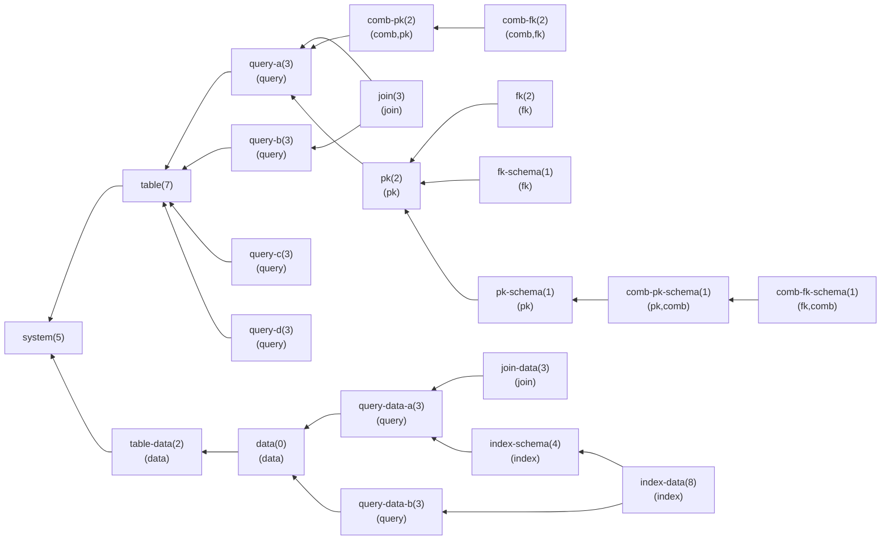
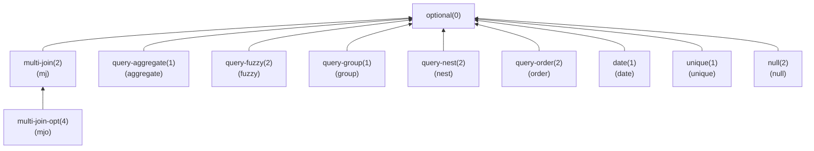
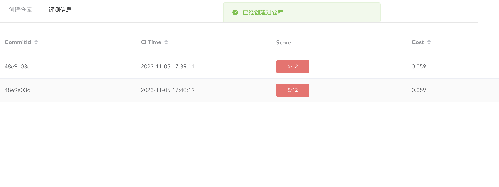
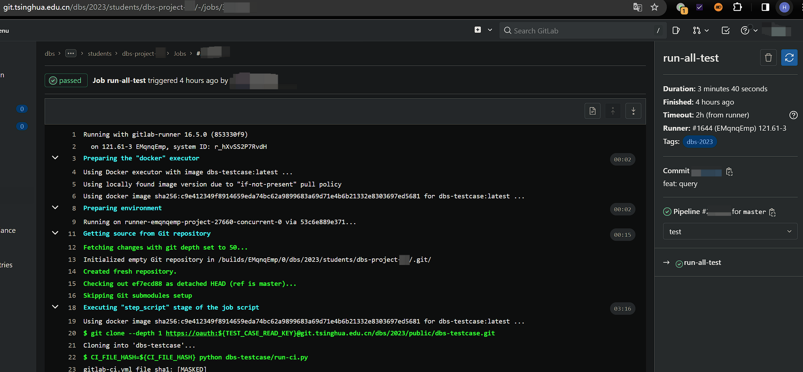

# 平台说明

我们会将分组DDL设在退课第一阶段结束后不久，分组DDL后开放仓库创建，每个组有一个仓库。注意如果你们分组已经非常明确，则完全可以在那之前开始完成实验，分发仓库后再将代码全部放入其中即可。

仓库创建通过教学实验平台 [UniLab Platform](https://lab.cs.tsinghua.edu.cn/unilab) 完成，分组信息导入完成后助教会发公告说明，通过该平台的指引可以创建仓库/获取权限。**注意对多人小组来说，第一位操作的同学通过该平台会创建仓库并获得权限，后续同学也需要通过该平台获取仓库的权限。**

由于测例中有必做内容也有选做内容，且测例之间可能存在明显的依赖关系，因此你可以通过设置相关 flag 变量的方法来约束 CI 进行的测试，从而使得你在完成部分测试时也能看到 CI 通过的✔️标志，同时也能有效避免无效的 CI 时间。关于 flag 的具体使用说明你可以在测例仓库的 README 中查看。

为了方便大家快速获知测例基本信息，下面放了一个用 Mermaid 绘制的流程图来表示测例依赖关系及其他元信息。每一个框代表一个测例，每个框中的第一行是测例名以及小括号内的分值，如果该测例需要满足 flag 才能开启则会第二行小括号内用逗号隔开的若干个 flag。注意，你必须通过了全部必做部分的测例后，才能开始完成选做测例（为此设置了一个名为 `optional` 的 0 分测例作为区分）。

!!!info "测例分值"

    简便起见，每个测例只有拿0分和拿满分两个情况，我们已经尽可能将测例进行拆散以便于大家得分。

下面是必做部分的测例：

下面是选做部分的测例：

!!! info "开发顺序"

    尽管实验文档是按照从下而上的顺序编写的，但是这个顺序可能并不符合敏捷开发的工程实践，相比之下你或许会希望快速完成整个框架，逐步通过部分测试以渐渐增长测试分数，这种情况下你也可以依据测例的依赖关系来决定你的功能实现顺序。

关于 `dbs-testcase` 的具体用法见该仓库的 `README.md`，强烈推荐你在本地进行测试完成后再运行CI，CI仅用作上传分数。

在你通过（部分或全部） CI 测例后，你可以在 CI 输出中看到自己的分数。我们通过 UniLab Platform 进行了分数汇总，这里会保留你的最高成绩作为最终成绩，你可以前往平台查看。

例如上述样例图片中的 `5/12` 即表明根据开启的 flag 可能运行的全部测例满分为 12 分，而实际上运行 CI 通过的测例总分为 5 分，因此最终得分为 5 分。

如果你希望查看 CI 运行的详细信息，例如在上例中想知道为何有 7 分没通过，则应该前往自己的清华 Gitlab 仓库查看评测详情。对 Gitlab 不熟悉的同学需要注意，从 Gitlab 仓库页面点击✔️或❌会进入到 Pipeline 页面，需要再点击具体的 Job 名字（如 `run-all-test`）才能进入 job 详情页查看具体的输出，如下图所示：

