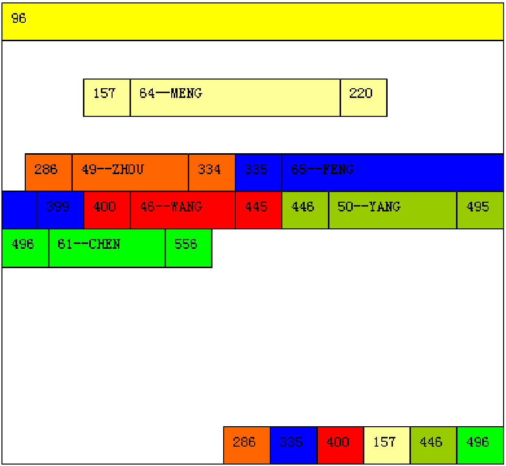
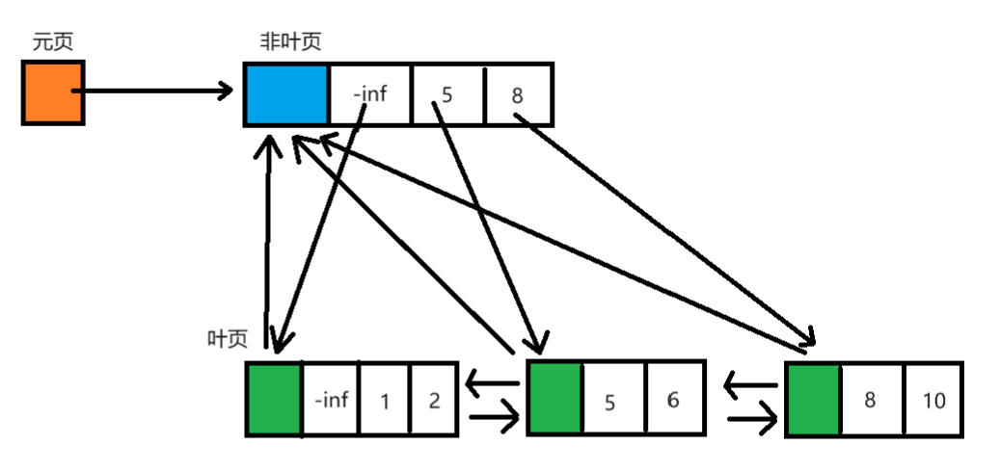
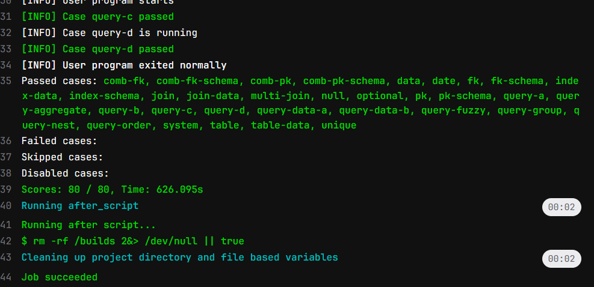
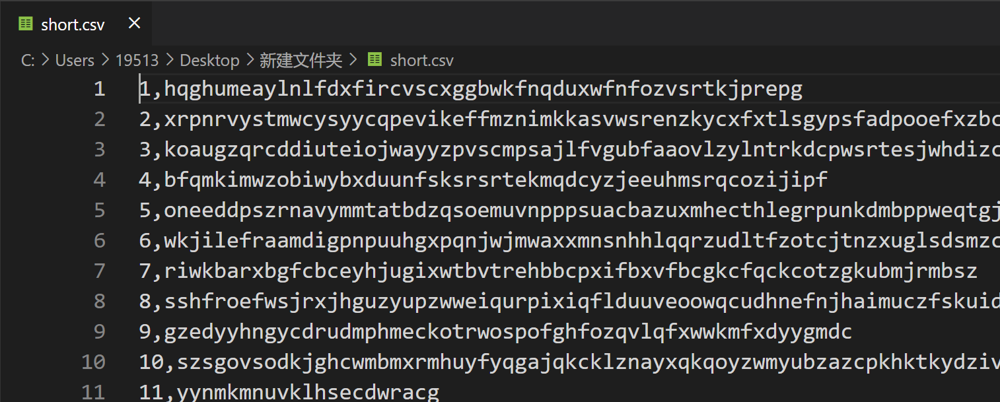

# 2023年秋35组项目总结报告

## 使用说明

【数据删除】

## 项目结构概述

下面列出了重要的代码文件

```
src/
+- pagefile/
|  +- pageCache.h  # 页文件系统前置类型定义
|  +- pageFileSys.h  # 页文件管理器和页缓存模块实现
|  +- pageFileSys.cpp
|  +- pageFileInterface.h  # 页文件管理器和页缓存模块接口
|  +- pageFileInterface.cpp
|
+- common/
|  +- types.h  # 定义基础类型别名
|  +- consts.h  # 定义常量
|  +- db_exception.h  # 定义异常
|  +- iterator_base.h  # 迭代器算法模板
|  +- automove_ptr.h  # 一个智能指针的简单实现
|
+- frontend/  # 由SQL.g4自动生成的代码
|
+- backend/
|  +- dbsys.h  # 后端接口文件
|  +- dbstream.h  # 调试用流输出接口
|  +- db_sys.cpp  # 数据库管理模块
|  +- db_stream.cpp  # 调试用流输出
|  +- db_record.cpp  # 堆式记录管理模块
|  +- db_index.cpp  # B+树索引模块
|  +- db_algorithm.cpp  # 一些值算法，如比较、排序等
|
+- sql/
|  +- DBTabulate.cpp  # 表格绘制
|  +- DBVisitor.cpp  # SQL语句分析处理
|
+- main.cpp  # 代码入口，包括后端测试代码
+- SQL.g4
```


## 后端模块设计

### 页管理模块

#### 概述

出于性能和项目完整性的考虑，我们自己实现了一个页式文件管理系统和页缓存管理。这个实现的主要特色是实现了对页较好的抽象，读取、写入页非常便捷。另外不需要上层手动管理`dirty`标记，标记和刷写都是自动完成的。

`pageFileSys.h`中定义了一个`FileManager`和一个`CacheController`的单例类，分别用于实现文件管理和缓存页管理。

`pageFileInterface.h`中定义了`PageFile`类、`RPage`类和`WPage`类，作为页管理的接口类。


#### 接口说明

下面给出`pageFileInterface.h`中接口类的主要接口。

```c++
// 页文件接口类
class PageFile
{
    // 初始化文件系统，指定工作目录
	static void init(const string& path);
	// 删除一个文件（夹）
	static void remove(const string& file);
	// 创建或打开一个文件
	explicit PageFile(const string& file);
	// 保存这个文件
	void flush() const;
	// 保存并关闭这个文件
	void close();
	// 页数
	i32 page_cnt() const;
	// 分配新页
	PageID alloc_page();
	// 获取只读页，不标记dirty
	RPage get_readonly_page(PageID pid) const;
	// 获取可读页，并标记dirty
	WPage get_writable_page(PageID pid);
};

// 只读页
class RPage
{
    // 判断空页
	bool empty() const;
    // 获取页文件
	PageFile get_page_file() const;
    // 获取页号
	PageID get_page_id() const;
    // 获取这一页的可写版本，并标记dirty
	WPage to_writable() const;

    // 将此页的某个bias以const T*形式返回
	template <typename T>
	const T* as(PageBias byteBias = 0) const;
};

// 可写页，继承只读页的接口
class WPage
	: public RPage
{
    // 将此页的某个bias以T*形式返回
	template <typename T>
	T* as(PageBias byteBias = 0);
};
```


#### 实现

`FileManager`的实现主要是维护了一个文件名到文件ID的映射表，这样可以根据文件名寻找到文件句柄。其他提供的诸如自动创建文件、刷新文件，几乎只是对`std::fstream`的进一步封装。

`CacheController`将缓存页组成一个循环链表，采用LRU+writeback的缓存策略。当缓存命中时，页会被插入到链表末尾；当缓存未命中，会从头开始，寻找首个未被引用的页牺牲，并将新页插入链表末尾。

`PageFile`将文件接口封装为一个类，方便了文件的访问。

`RPage`类和`WPage`类类似于`std::shared_ptr`，维护一个对页的引用计数，若页仍在使用时，缓存替换算法会忽略此页。同时，使用类型转换和const的特性，自动维护`dirty`标记。


### 迭代器和算法模块

#### 概述

此数据库系统使用了流水线的查询算法，一次处理一条数据，因此非常节省内存，效率也很高。流水线的核心就是迭代器。并且迭代器可以将通用算法和数据库的特定算法分离。

下面是迭代器基类模板的接口。

```c++
template <typename T>
class BaseIterator
{
	BaseIterator();
	virtual ~BaseIterator();
	// 定位下一个值
	virtual void single_step() = 0;
	// 返回当前值
	virtual T get() const = 0;
	// 是否结束，如果已经结束，调用single_step()和get()是UB
	virtual bool is_end() const = 0;
};
```


#### 继承关系

图中@表示虚基类，$表示数据库系统中特化的迭代器类

```
@BaseIterator<T>  # 迭代器基类
+- EmptyIterator<T>  # 空迭代器类
+- NumberIterator  # 自然数生成器类
+- @BasePipelineIterator<T, F>  # 流水线迭代器基类
|  +- @BaseMappingIterator<T, F>  # 映射迭代器基类
|  |  +- IdentityMappingIterator<T>  # 恒等映射迭代器类
|  |  +- FunctionalMappingIterator<T, F>  # 位置无关函数映射迭代器类
|  |  +- $RemoveHandleIterator  # 去除handle迭代器
|  |  +- $RecordHeapHandle::GetRecordIterator  # 堆句柄映射迭代器
|  |
|  +- @BaseFilterIterator<T>  # 筛选迭代器基类
|  |  +- LeakingFilterIterator<T>  # 无条件筛选迭代器类
|  |  +- FunctionalFilterIterator<T>  # 位置无关函数筛选迭代器类
|  |  +- $WhereRecordFilterIterator  # Where子句筛选迭代器
|  |  +- $WhereRecordValueFilterIterator  # Where子句值筛选迭代器
|  |
|  +- @BaseSubIterator<T>  # 子迭代器基类
|  |  +- BiasLimitIterator<T>  # 偏移和截断迭代器类
|  |
|  +- BufferedIterator<T>  # 缓冲区迭代器类
|  |  +- ReversedIterator<T>  # 倒序迭代器
|  |
|  +- @BaseCartesianProductIterator<T, F0, F1>  # 双源流水线基类
|  |  +- $HardJoinIterator  # 硬连接迭代器
|  |
|  +- SortedIterator<T>  # 排序迭代器
|  |  +- $SingleColumnSortIterator  # 单列排序迭代器
|  |  +- $SingleColumnSortValueIterator  # 单列值排序迭代器
|  |
|  +- $SingleColumnGroupIterator  # 单列分组聚合迭代器
|  +- $IndexedJoinIterator  # 索引加速的连接迭代器
|
+- $RecordHeapHandle::AllHandleIterator  # 堆全局迭代器
+- $BtreeIndexHandle::BtreeIndexIterator  # 索引范围迭代器
```


#### 实现

`SortedIterator<T>`使用的是堆排序，针对ORDER BY + LIMIT的情况对空间占用进行了优化。具体来说，若待排序总量$N$，限制输出排序后的前$K$项，令$k=min(K, N)$，则其时间复杂度$O(N\log k)$，空间复杂度$O(k)$。

`HardJoinIterator`是较为平凡的JOIN实现，仅仅是将两个迭代器的返回值做循环连接，后续再做筛选，时间复杂度$O(NM)$。。`IndexedJoinIterator`是用索引优化的JOIN实现，当等值条件一侧有索引时，即可使用索引查找值，时间复杂度$O(N\log M)$。

其他的算法都比较易懂。


### 数据库管理模块

#### 概述

这个模块主要是管理诸如数据库列表、Schema、约束等元数据。出于实现的便捷性考虑，使用了“文件夹即数据库”的管理方法，元数据序列化后保存在文本文件中。

具体文件格式如图：

```
db/  # 数据库根目录
+- dbs.txt  # 数据库名列表
+- <db_name>/
|  +- schemas.txt  # 表名列表
|  +- <table_name>/
|  |  +- pattern.txt  # 表格式、约束、索引列表
|  |  +- data.p  # 数据文件
|  |  +- <index_name>_i.p  # 索引文件
|  |  +- ...
|  +- ...
+- ...
```


#### 接口

下面给出了`DbSysHandle`，`DatabaseHandle`，`SchemaHandle`的主要接口。`SchemaHandle`中还有增删改数据的接口，此处未列出。

```c++
// 表句柄类
class SchemaHandle
{
	// 新构造
	SchemaHandle(DatabaseHandle* db_, const string& name, const Pattern& pattern);
	// 读取
	SchemaHandle(DatabaseHandle* db_, const string& name);
	// 表名
	string get_name() const;
    
	// 获取表结构
	const Pattern* get_pattern() const;
	// 获取记录堆
	RecordHeapHandle* get_record_heap();

	// 创建约束
	void add_constraint(const string& cons_name, ConstraintType type, FieldIdSet cols, string fk_ref={});
	// 删除约束，删除主键name可以为空
	void drop_constraint(const string& cons_name, ConstraintType type);
	// 获取约束，返回下标，-1表示不存在。
	// 由于共用命名空间，只需要一个name参数；name=""获取主键
	int get_constraint_name(const string& cons_name) const;
	// 获取全部约束
	std::vector<ConstraintDesc>* get_constraint();
	// 根据名字获取约束
	ConstraintDesc* find_constraint(const string& cons_name);
	// 获取索引
	std::vector<AutoMovePtr<BtreeIndexHandle>>* get_indexes();
};

// 数据库句柄类
class DatabaseHandle
{
    // 创建或打开数据库
	DatabaseHandle(string name);
    // 数据库名
	string get_name() const;
    
    // 获取表名列表
	const std::vector<string>& get_schema_name_list();
    // 创建表
	void create_schema(const string& name, const Pattern& schema_pattern);
    // 删除表
	void drop_schema(const string& name);
    // 获取表
	SchemaHandle* get_schema(const string& name);
};

// 数据库系统句柄类，单例
class DbSysHandle
{
    // 单例模式
	static DbSysHandle* inst();
    // 卸载全局单例
	static void uninstall();
    // 清空所有文件
	static void clear_all();

    // 获取当前数据库名
	string get_cur_db_name() const noexcept;
    // 获取数据库名列表
	const std::vector<string>& get_db_name_list();
	// 获取当前数据库句柄
	DatabaseHandle* get_cur_db();
	
    // 删除数据库
	void switch_db(const string& db_name);
    // 创建数据库
	void create_db(const string& db_name);
    // 删除数据库
	void drop_db(const string& db_name);
};

// 卸载DbSysHandle单例，用于程序退出前操作
void uninstall_dbsys();
```


#### 实现

除了实体名字重复或不存在，和增删约束时检查完整性约束，其他几乎所有检查都是由前端完成的，因此主要的逻辑并不复杂。值得一说的是约束管理和序列化。

将INDEX, UNIQUE, PK, FK统称为**约束**，**约束**=**约束条件**+**索引**，每一个**约束**都对应一个**索引**，不同的**约束**可能共用一个**索引**（索引可以理解为一棵B+树）。列序号有序对可以唯一地确定一个**索引**。因此，实现中**约束**和**索引**是分开管理的。新建的约束可能会新建索引，也可能复用现有的索引。当某个索引不再被任何约束所使用，这个索引应当被删除。另外，由于各种约束都是统一管理，因此共用一个命名空间是比较自然的。添加约束时，首先判断是否已经存在可用的索引，如果没有则新建；接着进行完整性约束判断；如果是外键，需要给引用的表添加引用标记；最后将索引关联到此约束完成添加约束。删除约束时，删除失败的充要条件是：删除的是主键且引用标记非空，删除完成后，若索引未被其他约束引用，可以将索引删除。

序列化/反序列化是将数据结构储存/读出的过程。为了实现的便捷性，使用了基于`basic_ostream::write/basic_ostream::read`的序列化/反序列化。对于定长的基本数据类型，如整数、枚举、基本数据组成的结构体，直接使用二进制读写即可；对于变长的数据类型，如`string`,`vector`，则先读写长度，再依次读写其元素。通过对要序列化/反序列化的类型重载符号`||`，很容易实现这个功能。这种实现方式的优势是泛用性极高，且读写速度很快。


### 堆式记录管理模块

#### 概述

堆式记录管理模块可以进行如下操作：

1. 插入：输入一条记录，返回其句柄
2. 查询：输入一个句柄，返回其记录
3. 删除：输入一个句柄，删除这条记录
4. 遍历：返回一个包含所有句柄的列表（实现中是一个遍历迭代器）

**保证**：一个记录被插入后，删除前，句柄不会改变

**不保证**：记录的任何顺序


#### 接口

```c++
// 多类型值
struct RecordField : public std::variant<NullValue, i32, f64, string>;

// 记录值
using RecordValue = std::vector<RecordField>;

// 记录句柄
struct RecordHandle
{
	PageID pid;
	SlotID sid;
};

// 记录
struct Record
{
	RecordHandle handle;
	RecordValue value;
};

// 堆式记录管理器句柄
class RecordHeapHandle
{
    // 读取或新建
	RecordHeapHandle(const string& filename_, const Pattern* pattern_);
    
	// 插入
	Record insert(const RecordValue& rec);
	// 查询
	Record get(RecordHandle h) const;
	// 获取记录数量
	usize size() const;
	// 删除
	void remove(RecordHandle h);
 
	// 全局迭代器
	class AllHandleIterator : public BaseIterator<Record>;
	// 全局迭代器工厂（插入删除会导致此迭代器失效）
	AllHandleIterator get_all_handler_iterator() const;

	// 句柄映射迭代器
	class GetRecordIterator : public BaseMappingIterator<Record, RecordHandle>;
	// 句柄映射迭代器工厂
	GetRecordIterator get_getter_iterator() const;
};
```


#### 变长短记录储存实现

下图是课件中SQL Server的记录格式。

{width=50%}

堆式记录管理模块的设计参考了SQL Server的记录管理设计，使用了页头+块+槽列表的模式。槽列表从页尾向前生长，每一个槽位2字节，保存记录块在页中的偏移；槽若为0代表槽位为空。

**页头格式**：

1. 下一个数据页编号
2. 槽数量
3. 记录数量
4. 尾空闲块偏移

数据页通过链表相连，便于遍历记录。

块分为记录块和空闲块。

**记录块格式**：

1. （2 Byte）块长度
2. （2 Byte）NULL位图
3. 依次填入定长字段；若为NULL，填入任意值
4. 依次填入变长字段，1 Byte长度，后面是内容；如果是NULL，不填入任何值
5. （...）空闲空间，记录不一定和块等长，允许预留空间

可以看出，只能支持长度<=255的变长字符串。

**空闲块格式**：

1. （2 Byte）此块长度
2. （2 Byte）下一个块的页内偏移
3. （4 Byte）下一个块的页编号
4. （...）空闲空间

**空间分配回收算法**：

空间分配算法较为简易，支持空闲块分裂回收，但不支持合并，因此可能产生碎片问题。将所有空闲页按照大小，分为16B一级的64级，组成64个链表。当需要块分配时，会从大到小搜索链表，找到满足如下条件的空闲块：大小足够；页槽位有空，或页尾块可以分配2B的新槽位。如果所需的大小和空闲块相差16B以上，执行块分裂。块回收算法比较简单，直接将块插入合适的空闲链表就行。

碎片问题可以通过碎片整理实现。由于记录的句柄由页编号、槽号组成，只要将页中每一个记录块从前往后依次放置，然后更新槽中的偏移量，即可完成碎片整理。但是由于时间关系，此功能并未实现。


#### 变长超长字段储存实现

为了解决储存超长字段的问题，引入链接页。链接页一共有6种，分别为包含32个大小为255的槽；16个大小为510的槽；……；1个大小为8160的槽。

当某条记录中有一个长度>255的字符串，需要将其存储到链接页中。首先不断截取前8160字节，存储到8160B的链接页中，直到其长度<8160。接着计算出其适合的槽位大小。此处有一个读写性能和存储效率的权衡。例如，对于一个长度为7650的字符串，可以将其存储到一个8160的槽中，也可以拆分存储到4080+2040+1020+510的槽中。尽管后者存储效率为100%，但是读一个字符串需要读4个页，而前者只需读一个页。目前使用的算法是：对于长度<8160的串，至多将其拆到两个页中，这样最差的存储效率为75%，平均90%左右。

存储完成后，记录下每一个链接页的页号（4B），槽号（1B），组成一个新的字符串，并在字符串最前面打上特殊字符标记。并将这个新字符串存储到记录页中。按照这种方法，大约可以存储长度高达255/5*8160=400K的字符串。

至于链接页的回收，是将相同类型的链接页组成一个链表。由于链接页的槽都是定长的，处理相对简单，不做赘述。


### B+树索引模块

#### 概述

一个索引维护了一个特定的列有序对到记录句柄的映射关系，并且提供了顺序访问的功能。具体来说，**键**是一个若干个整数组成的序列$K=(k_0,k_1,...,k_{w-1})$（$w$是索引列的数量），**值**是记录句柄$V=(pid,sid)$。但是这样实现还有一点缺陷，当数据删除时，由于可能有相同值，需要顺序地查找正确的句柄。因此，可以将键和值结合起来，组成一个必然唯一的键$K'=(k_0,k_1,...,k_{w-1},pid,sid)$。这样做还有一个好处就是值就在键中，不需要额外存储值。


#### 接口

真正控制树的是`BtreeController`类，下面展示的是接口类，Record会被接口类转成键$K'$

```c++
class BtreeIndexHandle
{
    // 读取或新建
	BtreeIndexHandle(SchemaHandle* schema_, const string& name_, const FieldIdSet& fields_);
	// 获取描述信息
	BtreeDesc get_desc() const;
	// 删除此索引，应立即析构
	void drop();

	// 插入记录，所有现有的迭代器失效
	void insert_record(const Record& rec);
	// 删除记录，所有现有的迭代器失效
	void remove_record(const Record& rec);
	// 判断值是否存在
	// 判断远程值是否存在，用于主键和外键
	bool value_exist(const RecordValue& v, const BtreeIndexHandle* remote = nullptr) const;
	// 判断是否不存在重复值
	bool is_unique() const;

	// 范围迭代器，输出记录句柄
	class BtreeIndexIterator : public BaseIterator<RecordHandle>;
	// 获取范围迭代器，默认值为 -inf < itr < +inf
	BtreeIndexIterator get_range_iterator(
		const std::vector<i32>& equal_val = {},
		i32 left_val = INT_MIN, bool left_eq = false,
		i32 right_val = INT_MAX, bool right_eq = false) const;
};
```

其中范围迭代器用于对查找优化，可以优化如下条件：

若某索引建立在$C_1,C_2,...C_{w-1}$上，查询条件是$C_1=v_1\and\ ...\and C_{m-1}=v_{m-1}\and v_{m1}\lhd C_m\lhd v_{m2}$，其中$\lhd$为小于或小于等于，且$C_{m+1},...C_{w-1}$均有NOT NULL约束，那么可以使用此索引的范围迭代器进行优化。


#### 实现

下图是B+树结构示意图

{width=67%}

每一个页都保存了父页的页号、左右兄弟的叶页号；非叶页的每一个节点值是子页的最小值，并且保存了子页的页号；元页保存了根页的页号。页中节点以数组的形式组织。

选择数组结构的原因是：链表虽然插入是常数复杂度，但是插入前都需要顺序地搜索插入位置，还是线性复杂度；而数组结构可以使用二分查找。一般来说，读操作比写操作更加频繁，牺牲部分写性能换取读性能是可以接受的。并且数组实现更加节约存储空间，增加了一个页容纳节点的个数。

**搜索过程**：

从根开始，二分搜索到<=目标的最后一个值，继续查找此子页，直到找到叶页。

**插入过程**：

首先查找到<目标的最后一个值（必然没有重复值），在其后面插入值。由于是在后面插入，不会影响页中最小值，故不需要向上更新值。如果页中节点到达某个临界值，执行页分裂。将页中的节点平分到两个页中，更新所有子页的父指针，然后递归地在父页中插入新节点。如果根节点要分裂，先创建包含一个节点的新根，再执行分裂。

**删除过程**：

删除过程和标准的（或者说是数据结构课上学的）B树差别较大。标准的B树中，超节点中的节点数小于N/2（N为上溢临界）就要发生下溢，下溢方法包括向左右兄弟挪用节点和与左右兄弟合并。这是由于一般的B树是用链表实现的，因此移动一个节点的代价非常小。而数组每次移动一个节点效率非常低。因此，自己设计了一个批量挪用的算法，并且放宽了下溢的界。

具体来说，当某页中节点数小于N/7，发生下溢。如果左右兄弟节点数>3N/7，执行节点平均，即两个页平均分配所有的节点，最终两个页的节点数都在2N/7\~4N/7；若左右兄弟节点数均<=3N/7，选择一个执行页合并，这和标准的过程类似，最终页的节点数页在2N/7\~4N/7，下溢可能向上传播。当下溢传播到根页的子页时，此时根页只剩余1个节点，直接删除，将其子页作为新页。


### 数据完整性约束

#### 概述

数据完整性约束并不是一个独立的模块，但是值得单独说。接口被嵌入`SchemaHandle`中，因为其可以同时控制堆和索引。


#### 接口

```c++
// Schema句柄
class SchemaHandle
{
	// 插入操作，同时进行数据堆操作和索引操作
	Record insert_unchecked(const RecordValue& rec);
	// 删除操作，同时进行数据堆操作和索引操作
	void remove_unchecked(const Record& rec);
	// 插入操作，先进行约束检查
	Record insert(const RecordValue& rec);
	// 删除操作，先进行约束检查
	void remove(const Record& rec);
	// 修改操作，
	Record update(const Record& old_val, const RecordValue& new_val);
};
```


#### 实现

**插入**：

1. 检查每一个约束，如有违反，抛出异常
   1. INDEX，不检查
   2. UNIQUE，检查值是否已存在
   3. PK，检查值是否已存在，是否非空
   4. FK，检查值是否为空，如果非空，在父表主键中是否存在
2. 数据插入堆
3. 数据插入索引，特别的，若索引列中有NULL，则不进入索引

**删除**：

1. 检查每一个外键引用，若值被外键引用，则抛出异常
2. 数据从堆中删除
3. 数据从索引中删除，特别的，若索引列中有NULL，则不需要删除

**修改**：

1. 检查是否修改了外键，若未修改，跳过删除前检查
2. 删除旧条目
3. 尝试添加新条目
4. 若添加失败，重新插入旧条目


## 前端模块设计

### 查询处理模块

针对单表查询，具有如下可优化条件：对于数据表上某个索引 $ I=(C_1,C_2,...,C_n)$，其中 $C_i$ 表示列；如果筛选条件在该索引列上经过约化，在该索引上表现为 $C_1 = V_1 \ and \ C_2 = V_2 \ ... \ and \  v_m<(=)C_m<(=)v_m$，即在前 $m-1$ 个索引列中取等号值，在第 $m$ 个索引列可以取区间值。其中 $0\le m\le n$，$m=0$ 退化成全表搜索；其余条件，包括其他列上的条件以及 LIKE，IN LIST，涉及字符串的比较条件等等均不属于此类。

综合考虑单表查询的可加速条件，分组聚合，排序分页操作，使用迭代器和算法模块中多种类通过 `connect()` 连接，完成单表查询的处理操作，拼接逻辑顺序链如下：

```
AllHandleIterator                       # 无法进行索引加速的链起点
(BtreeIndexIterator)                    # 能够进行索引加速的链起点
(->WhereRecordFilterIterator)?          # 能够索引加速条件之外的额外筛选条件
 ->RemoveHandleIterator                 # 删除句柄，仅保留值
(->SingleColumnSortValueIterator        
 ->SingleColumnGroupIterator)?          # 先排序，后分组聚合 GROUP BY
(->SingleColumnSortValueIterator        # 排序 ORDER BY
 ->ReversedIterator<RecordValue>)?      # 对于默认情况需要 Reverse，DESC 情况不需要
(->BiasLimitIterator<RecordValue>)?     # Offset + Limit
->[output/recurse]                      # 结果输出或递归返回
```

特别地，对于 UPDATE/DELETE 语句，虽然没有 GROUP BY，ORDER BY 的复杂筛选条件，但存在被筛选出来的值在修改后依然被重复选取的问题，因此需要使用 `BufferedIterator` 类进行暂存操作，使用的迭代器拼接逻辑顺序如下：

```
AllHandleIterator
(BtreeIndexIterator)
(->WhereRecordFilterIterator)?
 ->BufferedIterator<Record>
 ->[update/remove]
```

针对多表查询，存在如下多表可加速条件：对于 $C_i=D_j$，$C$ 和 $D$ 为不同表的列，如果 $D_j$ 是某个索引位序为 1 的列，则可以使用索引加速；特别地，如果同时存在 $C_i = D_j \ and \ C_p = D_q$，而 $D_j$ 和 $D_q$ 为该索引的前两列，也可以加速，依此类推；$D$ 和 $C$ 出现的先后顺序并不重要，也可以使用 $C$ 上的索引加速；实际实现过程简化为如下迭代器拼接模型（以双表为例，能够进行索引优化）：

```
AllHandleIterator                       # 第一张表全局迭代器
->RemoveHandleIterator                  # 删除句柄，仅保留值
->IndexedJoinIterator                   # 使用第二张表进行索引加速
->WhereRecordValueFilterIterator        # 两张表的其余 where 语句（第二张表的条件列序号需要加上第一张表偏移量）
(->SingleColumnSortValueIterator        
 ->SingleColumnGroupIterator)?          # 先排序，后分组聚合 GROUP BY，需要列重定向
(->SingleColumnSortValueIterator        # 排序 ORDER BY，需要列重定向
 ->ReversedIterator<RecordValue>)?      # 对于默认情况需要 Reverse，DESC 情况不需要
(->BiasLimitIterator<RecordValue>)?     # Offset + Limit
 ->[output/recurse]                     # 结果输出或递归返回
```

对于不存在索引优化的情况，仅需使用 `HardJoinIterator` 对两表筛选后的列进行硬连接即可；
对于更多表的情况，将 GROUP 与 ORDER 语句延迟到最后计算偏移，重复之上的索引加速/硬连接流程即可。


### 语法解析模块

语法解析使用实验框架默认提供的文法文件 `src/SQL.g4`，同时额外添加有关 `DATE` 数据类型的相关文法；对于文法文件使用 Antlr 库进行解析（通过 `./g4-generate.sh` 自动化生成解析器），生成具有 Visitor 模式的文件基类，位于 `src/frontend` 文件夹下；之后通过 `src/sql/DBVisitor.h` 继承自动生成的文法，从而实现自动文法解析功能。

针对自动生成的语法分析树，通过平凡的解析操作获取其语义信息，对接其余模块系统相应接口进行操作；对于获取到的异常信息根据当前所处不同模式的要求进行不同类型的处理。

对于涉及记录插入删改文法，在语法解析同时将进行类型检查，具体实现为：从数据表中提取相应列基本信息，与输入字段进行类型比对；特别地，在具体实现过程中实现了**隐式类型转换**，使用字符串插入表项类型为 INT 和 FLOAT、使用后者插入VARCHAR 的表项都是被允许的行为，具体通过 `std::stoi` 与 `std::stod` 执行类型转换，转换中出错才抛出类型不符异常。

对于索引增删语句，默认命名格式为——主键：Primary；外键：Foreign_[表名]；Index/Unique索引：Index_[col1]_[col2] 等；在创建索引时负责检查字段类型（在实验要求中为 INT 型）以及是否重复，在创建外键时检查 REFERENCE 的对象是否是主键。

对于 SELECT - FROM - WHERE - GROUP - ORDER 类型的复杂语句，执行的语法分析操作顺序如下：

- 将语句选中的所有表单列表入栈类全局成员变量栈 `targetTables`，用于子语句出错分析以及递归查询操作；

- 对于单表情形，遍历所有 WHERE 子句，针对所有 INT 列与整型数比较的情形，对 INT 类型查询条件进行约化，在所有 INT 列上创建新的条件类型，包括三种情况 `NONE`, `EQ` 和 `RANGE`，分别代表该列不存在筛选条件，筛选条件为相等和区间的情况，以下两句 SQL 语句均在列 `id` 上创建新条件类型，分别为 `RANGE` 型区间 \[6, 8\) 和 `EQ` 型取值 9；

  ```sql
  SELECT * FROM T WHERE T.id >= 6 AND T.id < 8;
  SELECT * FROM T WHERE T.id >= 5 AND T.id = 9;
  ```

- 由于所有条件用 AND 拼接，也可能导致筛选结果提前判断为空集直接返回，例如以下语句：

  ```sql
  SELECT * FROM T WHERE T.id >= 6 AND T.id < 8 AND T.id = 10;
  SELECT * FROM T WHERE T.id >= 5 AND T.id = 9 AND T.id > 10;
  ```

- 处理 ORDER BY 和 GROUP BY 子句，获取其表单以及列序号，同时处理 OFFSET 和 LIMIT 获取具体值；

- 根据 SELECT *，SELECT 某些列，SELECT 列聚合以及多表 JOIN 不同情况区分考虑：

  1. SELECT * 的情况，要求中规定只能单表（事实上多表完全可以实现），首先根据索引加速条件筛选出能够通过索引 B+ 树加速的条件，再根据无法加速的条件构建 WHERE 语句迭代器，之后针对索引加速与否，是否排序并指定 OFFSET 和 LIMIT 进行区分；
  2. SELECT 单表某些列的情况，存在涉及聚合函数的情况，需要使用 GROUP BY 迭代器策略；其余实现步骤与 SELECT * 一致；
  3. SELECT 多表的情况，需要针对条件查找多表索引优化的使用；具体实现采用较为简单的一种方式，即逐表查找引用的筛选可能；即从双表开始依次查找是否拥有针对第二张表的可能索引加速，针对不同的情况对双表采用 `HardJoin` 以及 `IndexedJoin` 的方式；按照 SQL 语句中的顺序，每引入一张表都遍历查找条件，搜索是否存在加速的情况；另外的方法为在多表上构建索引关联树，从而更好决定加速条件的选取，但在实现中较为复杂；其他不可加速条件以及 GROUP，ORDER 子句处理方式同单表；
     **在多表的情形下**，由于序列号经过多轮重组，在解析函数中同时**维护当前选中列信息的列表**，保证选择的列与语义一致。

其他涉及 WHERE 语句的操作流程与上述对 WHERE 的处理类似，例如 UPDATE 和 DELETE，不同的是 UPDATE 和 DELETE 只涉及单表，也没有 SELECT 中复杂的分组聚合与排序，因此要简单很多。
在前端针对查询策略创建了如下前端专用类，位于 `src/sql/WhereMeta.h` 中：

```cpp
// 描述Where_Clause类型
struct whereClauseMetaFront {
    // 语句类型
    ClauseType clause_type;
    // 操作符类型
    std::variant<CmpOperator, NullOperand> operand = NullOperand();
    // 表名
    std::string schema;
    // 列名
    std::string column;
    // 操作值表
    std::vector<RecordField> values = {};
};

// 描述Selector类
struct selectorMetaFront {
    // 聚合函数
    AggregatorType ag_type;
    // 表名
    std::string schema;
    // 列名
    std::string column;
    // 表名是否定义
    bool schemaDefined;
}; 

enum class FieldConditionType : i8 {
    NONE = 0,
    EQ,
    RANGE
};

// 针对每个 Field 的可加速条件类（单表）
struct FieldConditions {
    // 可加速类型
    FieldConditionType cond_type = FieldConditionType::NONE;
    // 能加速只能是 int，当类型为 EQ 则 values[0] 表示取值，为 RANGE 则表示区间
    std::vector<i32> values = {-2147483648, 2147483647};
    // 左端点取等
    bool left_eq = false;
    // 右端点取等
    bool right_eq = false;
    // 语句对应的 where_clause 所在项
    std::vector<i32> whereIndex = {};
};
```

对于递归查询的处理实现依赖全局成员变量栈 `targetTables`，在进入一个查询的解析函数时，通过该栈是否为空判断当前是否处于递归查询过程中，设置函数临时布尔类型变量 `recurseSearch`。该变量被激活时，屏蔽查询的任何可能的输出（出错除外），转而将所有输出结果递归返回给上一层查询中的 `where_clause`；同时对于所有递归中的查询，其结果合法当且仅当只有一列或单个聚合函数被筛选出来，否则抛出异常；`where_operator` 收到的递归返回结果尽可能为单值，`where_in` 则可支持单列多值；

DATE 类型直接在解析过程中通过合法性判断之后转换成 INT 类型存储和比较，而不需要创建新的类型。


### 前端交互模块

为了符合迭代器流水线的交互方式，在 `DBTabulate.cpp` 中实现了简单的表格绘制类方法，并能够支持中文输出时的用户友好性。
针对交互模式全面仿照 MySQL 系统，对于增删改操作输出 `Query Ok`，对于筛选查看操作输出 `Rows in set`，对于筛选结果为空输出 `Empty Set` 语句，并能够输出操作时间。
使用某个测试用例，在交互模式下输出示意图如下：

```sql
sql> SELECT C_MKTSEGMENT, COUNT(*), MAX(C_ACCTBAL)  FROM CUSTOMER GROUP BY C_MKTSEGMENT;
+============+============+==============+
|C_MKTSEGMENT|COUNT(*)    |MAX(C_ACCTBAL)|
+============+============+==============+
|MACHINERY   |8956        |9999.640000   |
|HOUSEHOLD   |9130        |9990.920000   |
|FURNITURE   |8961        |9999.720000   |
|BUILDING    |9088        |9999.490000   |
|AUTOMOBILE  |8865        |9997.840000   |
+============+============+==============+
5 rows in set (1.267 sec)
```

针对报错信息处理统一使用 `db_exception_base` 基类的派生类，用来代表数据库使用途中的各种错误；特别地，对于破坏唯一性约束、破坏外键约束、主键约束数量错误、日期错误以及 NULL 类型错误的情况，在批处理模式按照要求输出 `!ERROR` 进行特殊处理，而不是抛出异常。


## 实验结果

### 功能

CI 得分 80/80，获得全部 CI 分数：



具体完成的功能为：

**基础功能**：基本运行，系统管理，查询解析，完整性约束，模式管理，索引模块
**选做功能**：多表 JOIN，模糊查询，聚合查询，分组查询，排序分页，嵌套查询，变长字符串存储，日期 DATE，UNIQUE 约束，NULL 完整性约束

对于使用索引进行单表查询优化的操作，使用测例 index-data 中在大数据表上的筛选操作进行测试，性能提升效果如下：

```sql
-- 优化前：17.18 s，优化后：0.007 s
DELETE FROM LINEITEM WHERE L_ORDERKEY >= 450950 AND L_ORDERKEY < 451050;
-- 优化前：3.71 s，优化后：0.002 s
SELECT * FROM ORDERS WHERE O_ORDERKEY > 5 AND O_ORDERKEY < 50;
```

另外，对于多表查询的极端情形（测例中的五表连接），采用硬连接方法几乎无法保证能够在限定时间内完成 CI，使用索引优化查询后时间缩短至 61s 左右；综上所述可见使用索引提升效果明显。


### 运行时间和运行内存

由于使用了流水线模式，即使在缓存页非常少的情况下，也能达到较好的性能。下面实际测试了100页(0.8MB)和10000页(80MB)的效果。

| 缓存页数量              | 100  | 10000 |
| ----------------------- | ---- | ----- |
| 总运行内存              | 7MB  | 87MB  |
| 5表join测例（复杂查询） | 63s  | 61s   |
| data测例（大量插入）    | 304s | 268s  |

### 磁盘占用

用验收时展示的字符串插入测试测试磁盘占用。

short.csv是总长为10,000,000的字符串，长度10-200均匀分布。

long.csv是总长为100,000,000的字符串，长度30-30000，对数均匀分布。



```sql
DROP DATABASE VARCHARTEST;
CREATE DATABASE VARCHARTEST;
USE VARCHARTEST;

CREATE TABLE SHORTSTR (ID INT, VALUE VARCHAR(30000));
CREATE TABLE LONGSTR (ID INT, VALUE VARCHAR(30000));
LOAD DATA INFILE '/short.csv' INTO TABLE SHORTSTR FIELDS TERMINATED BY ',';
LOAD DATA INFILE '/long.csv' INTO TABLE LONGSTR FIELDS TERMINATED BY ',';
```

结果：

|       | .csv文件大小 | 数据堆文件大小 |
| ----- | ------------ | -------------- |
| short | 10.7 MB      | 11.6 MB        |
| long  | 100 MB       | 106.2 MB       |


## 小组分工

【数据删除】：框架搭建，后端，报告相关部分

【数据删除】：前端，CI，报告相关部分


## 第三方库使用清单

Antlr4：用于文法解析

argparse：用于命令行参数解析


## 参考文献

无


## 其他贡献

【数据删除】
